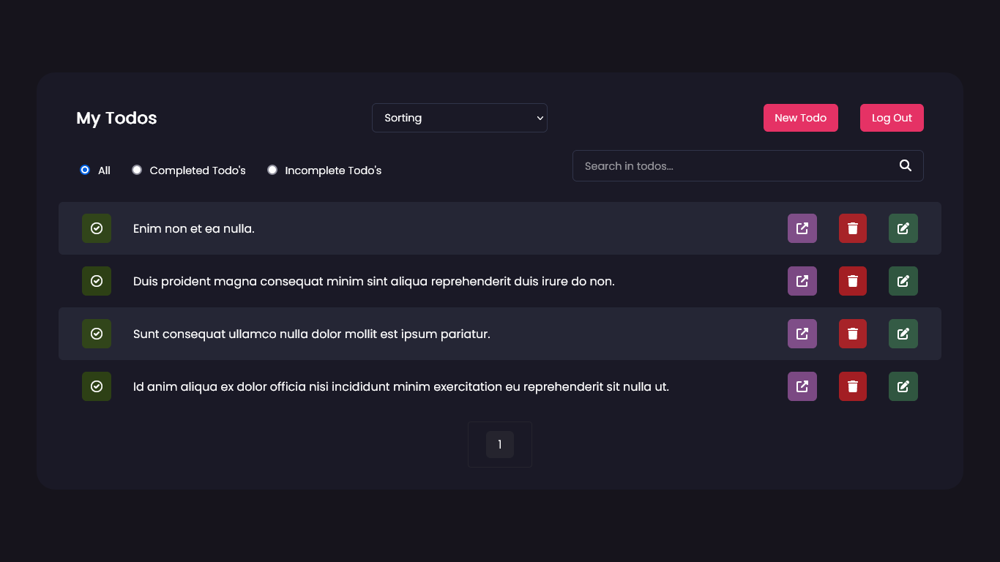

# Todo-App

**_Todo App_**

## Technologies

-   **Html**
-   **Css**
-   **JavaScript**
-   **Php**
-   **Laravel**
-   **Vue**

## Dependencies

-   Sanctum
-   Vue-Router
-   Vuex
-   Vuex Persistedstate
-   Vue Loader
-   Axios
-   Google Fonts(Poppins)

## Project Setup Process

### Install composer (for php packages)

```sh
composer install
```

### Create .env file

```sh
1. duplicate the ".env.example" in main folder
2. rename the file you copied to ".env"
3. configure the ".env" file you renamed
```

### Create app key

```sh
php artisan key:generate
```

### Run migrations (for create database tables)

```sh
php artisan migrate
```

### Run Seeders (for datas)

```sh
php artisan db:seed
```

### Run Admin Seeder (for admin user)

```sh
php artisan db:seed --class=AdminSeeder
```

### Run project

```sh
php artisan serve
```

### Install npm (for npm packages)

```sh
npm install
```

### to run project in development environment

```sh
npm run dev
```

### Compile and Minify for Production

```sh
npm run build
```

### Lint with

```sh
npm run lint
```

### Open Link

```sh
http://localhost:8000/
```

## Admin User Credentials

-   Email: admin@todo.com
-   Password: admin1todo

## **Pages**

-   _Welcome_ (path: '/') - _(only guests)_
-   _Register_ (path: '/register') - _(only guests)_
-   _Login_ (path: '/login') - _(only users)_
-   _MyTodos_ (path: '/my-todos') - _(only users)_
-   _AllTodos_ (path: '/all-todos') - _(only admins)_
-   _NewTodo_ (path: '/new-todo') - _(only users)_
-   _TodoDetail_ (path: '/todo-detail/{:todoId}') - _(only users)_
-   _TodoEdit_ (path: '/todo-edit/{:todoId}') - _(only users)_

## **Api Documentation**

### **_Users_**

-   _Controller_: UserController
-   _Model_: User
-   _Database_: users
-   _Collection_: UserCollection
-   _Resource_: UserResource
-   _Factory_: UserFactory
-   _Seeder_: UserSeeder
-   _Main Route_: /api/users

### **_Todos_**

-   _Controller_: TodoController
-   _Model_: Todo
-   _Database_: todos
-   _Collection_: TodoCollection
-   _Resource_: TodoResource
-   _Factory_: TodoFactory
-   _Seeder_: TodoSeeder
-   _Main Route_: /api/todos
